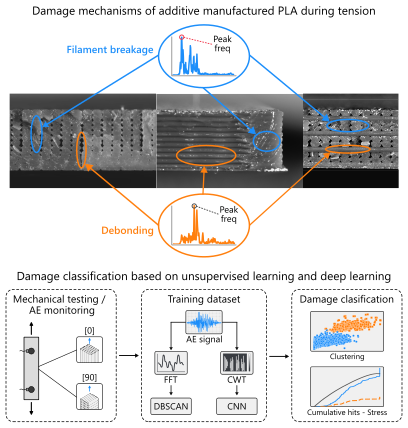

# Damage_identification_AE_AI
This repository provides a framework for damage identification in PLA specimens using Acoustic Emission (AE) data acquired during tensile tests. 

Feature extraction is performed using both **Fast Fourier Transform (FFT)** and **Continuous Wavelet Transform (CWT)** methods. 

The extracted features are used to train unsupervised learning models **(DBSCAN and KMeans)** as well as supervised models **(such as Convolutional Neural Networks, CNNs)** to predict and classify damage mechanisms. While the current implementation focuses on PLA specimens, the framework could be extend to other materials and experimental setups.

Below is the graphical abstract summarizing the project:



## Installation

1. Create a new conda environment and activate it:
    ```bash
    conda create -n ae python=3.12
    conda activate ae
    ```

2. Install the required dependencies:
    ```bash
    pip install -r requirements.txt
    ```

## Quick Start

To use the pre-trained models for **prediction** on the provided feature-extracted dataset chosse between unsupervised and supervised models.

### Unsupervised (DBSCAN / k-means)

1. Ensure the `models/` directory contains [`dbscan_model.joblib`](models/dbscan_model.joblib) or the [`kmeans_model.joblib`](models/kmeans_model.joblib)

2. Open the [`predictions.py`](predictions.py) file and run it with the default parameters.

This script is going to take the total dataset [`Dataset_total.csv`](datasets/Dataset_total.csv) which have different printing directions defined in the **test_id** column.

It will used both unsupervised models to predict the damage mechanisms: [0] for filament breakage and [1] for debonding.

The labels for both models will be saved at the `results/`directory.

The following figures will be plotted:
- A t-SNE scatter plot with out classification
- A comparison between the DBSCAN and k-means model
- A feature vs feature scatter plot with classification
- A stress and cumulative hits vs time with and without clasification

### Supervised model (CNN)


## Detailed Usage

The [`transient.py`](transient.py) and the [`data_visualization.py`](data_visualization.py) files are used to inspect data and plot some figures like the transient signal, feat. vs feat plots and stress vs. hit plots.

In the `utils/` directory there are all the functions for feature extraccion and data processing functions.

### Unsupervised model
#### 1. Feature Extraction
The [`dataset_generator.py`](dataset_generator.py) file extracts frequency features using the FFT method and it saves the dataset as a .csv file  in the `datasets/` directory.   

#### 2. Training Models
The [`unsupervided_model.py`](unsupervided_model.py) is used to train the DBSCAN and k-means models over the total previous created dataset. It shows the same plots as in the
section above (see [Unsupervised (DBSCAN / k-means)](#unsupervised-dbscan--k-means)). This script allows you to experiment with clustering parameters and visualize the results. After training, the models are saved in the `models/` directory for later use in prediction.

#### 3. Making predictions
Refer to [Unsupervised (DBSCAN / k-means)](#unsupervised-dbscan--k-means) section.

### Supervised model
#### 1. CWT images
The [`generate_cwt_images.py`](generate_cwt_images.py) file generates cwt images for the CNN training and saves them in the `datasets/images` directory. 

#### 2. Training Models
The [`CNN_training.py`](CNN_training.py) is used to train CNN over the CWT images previously created. It can be used with the [`Dataset_0_y_90_labeled.csv`](datasets/Dataset_0_y_90_labeled.csv) file to make an hybrid approach using the labes obtained from the DBSCAN model. After training, the models are saved in the `models/` directory for later use in prediction.

#### 3. Making predictions
Refer to [Supervised model (CNN)](#supervised-model-cnn) section.

## Repository Structure

- `data/` - Raw and processed datasets
- `models/` - Saved models
- `extract_features.py` - Script for feature extraction
- `train_unsupervised.py` - Script for unsupervised model training
- `train_supervised.py` - Script for supervised model training
- `predict.py` - Script for making predictions

## Notes

- Ensure your data paths and model paths are correct when running scripts.

- This code implements methods and algorithms whose theoretical foundations are discussed in detail in our submitted paper. Once the paper is published, we highly encourage readers to consult it for a deeper understanding of the underlying theory.

- If you use this code in your research, please consider citing both the paper (once available) and this repository usign the information found below in [Citation](#citation).
 
## Citation

Use this bibtex to cite this repository:

```bibtex
@misc{byron2024damageae,
    title        = {Damage Identification in PLA Specimens Using Acoustic Emission and AI},
    author       = {Byron Barriga-Machado},
    year         = {2025},
    howpublished = {\url{https://github.com/ByronGerman/Damage_identification_AE_AI}},
    note         = {GitHub repository}
}
```

## License

This project is licensed under the MIT License. See the [LICENSE](LICENSE) file for details.